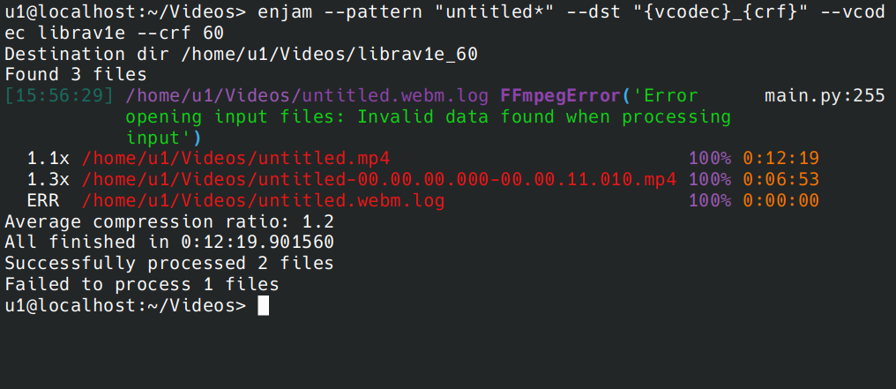

[](https://pypi.org/project/enjam/)


# Enjam

Batch convert video files.



```
Usage: enjam [OPTIONS]

  Batch convert videos.

Options:
  --src DIRECTORY                 [default: .]
  --dst TEXT                      Output directory path. Can include
                                  variables. Example: ./{vcodec}-{crf}
                                  [default: (src)]
  --exclude-dstdir                Do not pick source files from dstdir, if it
                                  is located inside srcdir   [default: True]
  --jobs INTEGER                  [default: 4]
  --acodec TEXT                   [default: copy]
  --vcodec [libaom-av1|librav1e|libsvtav1|libx264|libx265|copy]
                                  [default: libsvtav1]
  --vbitrate TEXT                 If stars with x, resulting bitrate is a
                                  ratio of input file resolution. Example:
                                  x2.3 or 200k
  --abitrate TEXT                 [default: 38k]
  --crf INTEGER RANGE             Constant rate factor. Or qp for rav1e.
                                  [default: (24, if vbitrate is not set);
                                  0<=x<=63]
  --speed [ultrafast|superfast|veryfast|faster|fast|medium|slow|slower|veryslow|placebo|-2|-1|0|1|2|3|4|5|6|7|8|9|10|11|12|13]
                                  Speed preset. String for x264/x265. Numeric
                                  for av1. Lower is slower.  [default: 7]
  --fprefix TEXT                  Output file prefix. Can include variables.
                                  If fprefix is not provided and dst dir
                                  includes variables, fprefix is set to the
                                  same pattern as dst dir name. Example:
                                  {vcodec}-{crf}-  [default: (f'{dst.name}-'
                                  if '{' in dst else None)]
  --gop INTEGER                   Group of pictures size. The GOP size sets
                                  the maximum distance between key frames.
                                  Higher GOP size results in smaller file
                                  size.   [default: 200]
  --grain INTEGER                 [default: 0]
  --write-log / --no-write-log    [default: write-log]
  --verbose / --no-verbose        [default: no-verbose]
  --skip-errors / --no-skip-errors
                                  Continue processing queue after one file
                                  error  [default: skip-errors]
  --pattern TEXT                  [default: *.gif]
  --install-completion            Install completion for the current shell.
  --show-completion               Show completion for the current shell, to
                                  copy it or customize the installation.
  --help                          Show this message and exit.

```

## Installation
```
pipx install enjam

enjam --install-completion
```


## Development
```
pdm venv create -n 11 3.11
eval $(pdm venv activate 11)

```

### Test
```
pytest -s --doctest-modules
```
